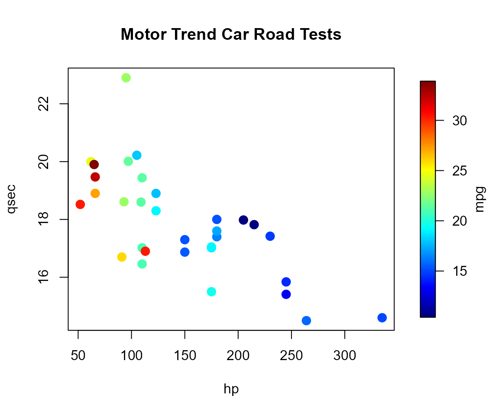
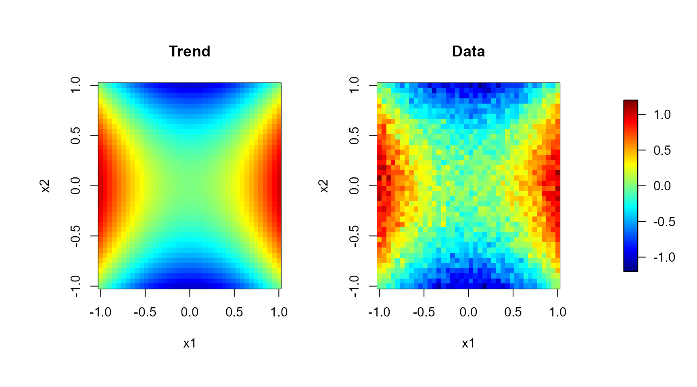
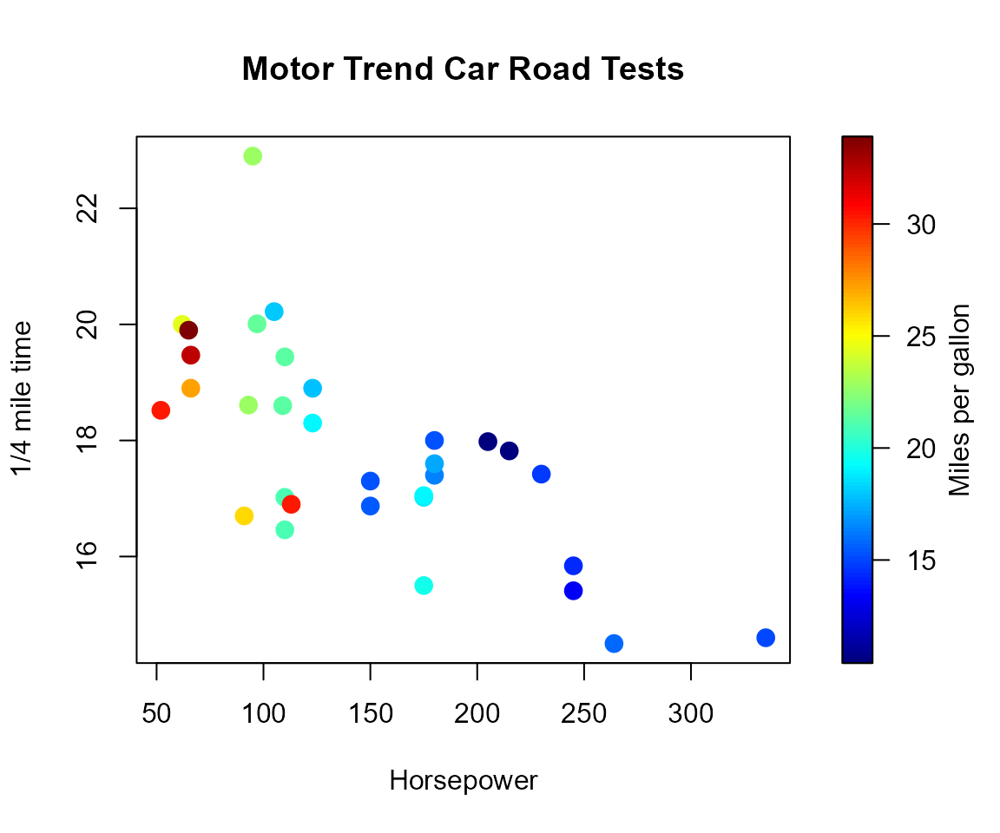
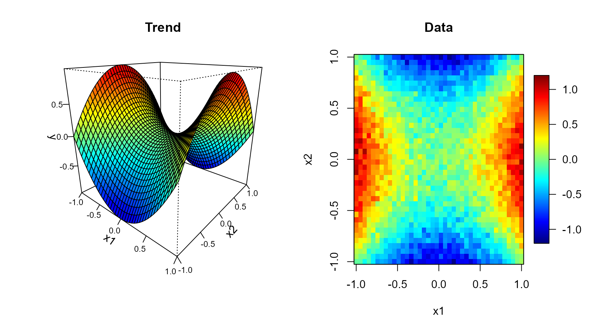
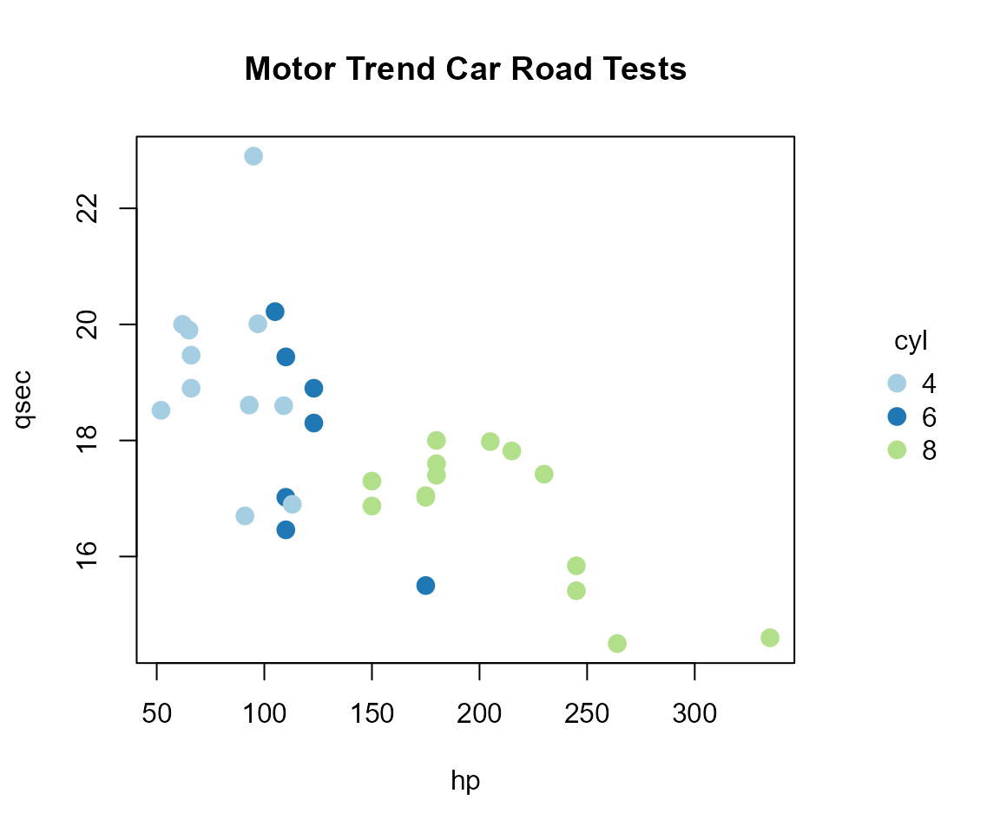

# An introduction to legendplot

## Introduction

`legendplot` provides tools to combine standard R plots, or
[`rgl`](https://dmurdoch.github.io/rgl/) 3D plots, with a legend
representing either a continuous color scale or a categorical (factor)
legend.

The basic graphics device only provides the
[`legend()`](https://rdrr.io/r/graphics/legend.html) function for adding
legends, with the problem that it can obscure the main plot;
furthermore, it is only suitable for categorical values and is not
useful for adding a continuous color scale. The `rgl` package only
offers
[`legend3d()`](https://dmurdoch.github.io/rgl/dev/reference/bgplot3d.html),
which incorporates the standard legend as a bitmap background for the
current RGL subscene.

`legendplot` (currently) provides the following main functions:

- **Standard plots**:
  - With a continuous legend:
    [`splot()`](https://rubenfcasal.github.io/legendplot/reference/splot.md),
    [`spoints()`](https://rubenfcasal.github.io/legendplot/reference/spoints.md),
    [`simage()`](https://rubenfcasal.github.io/legendplot/reference/simage.md),
    and
    [`spersp()`](https://rubenfcasal.github.io/legendplot/reference/spersp.md).
  - With a categorical legend:
    [`fplot()`](https://rubenfcasal.github.io/legendplot/reference/fplot.md)
    and
    [`fpoints()`](https://rubenfcasal.github.io/legendplot/reference/fpoints.md).
- **`rgl` plots**:
  - With a continuous legend:
    [`splot3d()`](https://rubenfcasal.github.io/legendplot/reference/splot3d.md),
    [`spoints3d()`](https://rubenfcasal.github.io/legendplot/reference/spoints3d.md),
    [`spersp3d()`](https://rubenfcasal.github.io/legendplot/reference/spersp3d.md)
    and
    [`sshade3d()`](https://rubenfcasal.github.io/legendplot/reference/sshade3d.md).
  - With a categorical legend:
    [`fplot3d()`](https://rubenfcasal.github.io/legendplot/reference/fplot3d.md),
    [`fpoints3d()`](https://rubenfcasal.github.io/legendplot/reference/fpoints3d.md)
    and
    [`fshade3d()`](https://rubenfcasal.github.io/legendplot/reference/fshade3d.md).
- **Color tools**:
  - For continuous legends:
    [`scolor()`](https://rubenfcasal.github.io/legendplot/reference/continuous-color.md),
    [`jet.colors()`](https://rubenfcasal.github.io/legendplot/reference/continuous-color.md)and
    [`hot.colors()`](https://rubenfcasal.github.io/legendplot/reference/continuous-color.md)
  - For categorical legends:
    [`fcolor()`](https://rubenfcasal.github.io/legendplot/reference/categorical-color.md),
    [`hcld.colors()`](https://rubenfcasal.github.io/legendplot/reference/categorical-color.md)
    and
    [`cat.colors()`](https://rubenfcasal.github.io/legendplot/reference/categorical-color.md).
- **`rgl` tools**:
  [`new3d()`](https://rubenfcasal.github.io/legendplot/reference/new3d.md),
  viewpoint
  (e.g. [`setviewpoint3d()`](https://rubenfcasal.github.io/legendplot/reference/viewpoints.md))
  and mouse actions
  (e.g. [`setmouse3d()`](https://rubenfcasal.github.io/legendplot/reference/mouse-actions.md))
  utilities.

Other packages that may be of interest are:

- [`plot3D`](https://cran.r-project.org/package=plot3D): Plotting
  Multi-Dimensional Data.
- [`ggplot2`](https://ggplot2.tidyverse.org/): Create Elegant Data
  Visualisations Using the Grammar of Graphics.
- [`plotly`](https://plotly-r.com/): Create Interactive Web Graphics via
  [plotly.js](https://plotly.com/javascript/).

Nevertheless, I prefer standard or `rgl` graphics, mainly because they
render faster when dealing with large amounts of data (also following
the “keep it small and simple”,
[KISS](https://en.wikipedia.org/wiki/KISS_principle), principle).

``` r

library(legendplot)
## legendplot: Standard and 'rgl' Plots with Legends,
##   version 0.4-1 (built on 2026-09-11).
##   Copyright (C) R. Fernandez-Casal 2012-2026.
##   Type `vignette("legendplot", package = "legendplot")`
##   or visit https://rubenfcasal.github.io/legendplot
##   for an overview.
```

## Continuous scales in standard plots

The base function for a continuous legend is
[`splot()`](https://rubenfcasal.github.io/legendplot/reference/splot.md).
It splits the plotting region into a main panel and a legend strip
showing a continuous color scale (based on
[`fields::image.plot()`](https://rdrr.io/pkg/fields/man/image.plot.html)).
After calling this function, the main graph can be draw as usual. For
example:

``` r

scale.range <- range(mtcars$mpg)
res <- splot(slim = scale.range, legend.lab = "mpg")
with(mtcars, 
     plot(hp, qsec, col = scolor(mpg, slim = scale.range),
          pch = 16, cex = 1.5, main = "Motor Trend Car Road Tests")
)
```



``` r

par(res$old.par) # restore graphical parameters; equivalent to `par.reset()`
```

[`scolor()`](https://rubenfcasal.github.io/legendplot/reference/continuous-color.md)
maps a numeric vector to colors from a continuous palette, such as:

- [`jet.colors()`](https://rubenfcasal.github.io/legendplot/reference/continuous-color.md):
  rainbow-style palette (similar to MATLAB `jet`).
- [`hot.colors()`](https://rubenfcasal.github.io/legendplot/reference/continuous-color.md):
  useful for values ranging from zero to a maximum (e.g. densities).

[`splot()`](https://rubenfcasal.github.io/legendplot/reference/splot.md)
can be also used with `add = TRUE` to attach a legend to an existing
plot. For instance, several plots can share a common color scale:

``` r

set.seed(1)
nx <- c(40, 40)
x1 <- seq(-1, 1, length.out = nx[1])
x2 <- seq(-1, 1, length.out = nx[2])
trend <- outer(x1, x2, function(x, y) x^2 - y^2)
y <- trend + rnorm(prod(nx), 0, 0.1)

scale.range <- c(-1.2, 1.2)
scale.color <- jet.colors(256)

old.par <- par(mfrow = c(1, 2), omd = c(0.05, 0.85, 0.05, 0.95))
image(x1, x2, trend, zlim = scale.range, main = "Trend", col = scale.color)
image(x1, x2, y, zlim = scale.range, main = "Data", col = scale.color)
par(old.par)
splot(slim = scale.range, col = scale.color, legend.shrink = 0.7, add = TRUE)
```



The package also supplies high-level functions that make this pattern
automatic. The `sxxxx()` family of functions
([`spoints()`](https://rubenfcasal.github.io/legendplot/reference/spoints.md),
[`simage()`](https://rubenfcasal.github.io/legendplot/reference/simage.md)
and
[`spersp()`](https://rubenfcasal.github.io/legendplot/reference/spersp.md))
draws the color-scale legend and the corresponding base plot
([`plot()`](https://rdrr.io/r/graphics/plot.default.html),
[`image()`](https://rdrr.io/r/graphics/image.html) or
[`persp()`](https://rdrr.io/r/graphics/persp.html)), with the
appropriate colors, in a single call:

``` r

with(mtcars, 
     spoints(hp, qsec, mpg, main = "Motor Trend Car Road Tests",
             xlab = "Horsepower", ylab = "1/4 mile time", 
             legend.lab = "Miles per gallon")
)
```



These functions are “compatible” with the `mfcol` and `mfrow` graphics
parameters:

``` r

old.par <- par(mfrow = c(1, 2))
spersp(x1, x2, trend, slim = scale.range, main = "Trend", zlab = "y", legend = FALSE)
simage(x1, x2, y, slim = scale.range, main = "Data", legend.mar = 10, legend.width = 3)
```



``` r

par(old.par)
```

All of them share the same legend-related arguments as
[`splot()`](https://rubenfcasal.github.io/legendplot/reference/splot.md),
and accept `legend = FALSE` to draw the main plot without a legend. By
default, the graphical parameters are reset to the values before
entering the function. If `reset = FALSE` they will not be restored to
make it possible to add more features to the plot (e.g. using functions
such as points or lines). The graphical parameters can be restored using
the `old.par` returned values or by calling function
[`par.reset()`](https://rubenfcasal.github.io/legendplot/reference/par.reset.md).

## Categorical legends in standard plots

[`fplot()`](https://rubenfcasal.github.io/legendplot/reference/fplot.md)
is the categorical counterpart of
[`splot()`](https://rubenfcasal.github.io/legendplot/reference/splot.md):
instead of a color bar it draws a classic factor-level legend (with
boxes, points or line segments), using
[`legend()`](https://rdrr.io/r/graphics/legend.html) internally.

``` r

f <- as.factor(mtcars$cyl)
res <- fplot(levels(f), col = cat.colors(nlevels(f)), type = "point",
             legend.lab = "cyl")
with(mtcars, plot(hp, qsec, col = fcolor(f, col = res$col),
                   pch = 16, cex = 1.5, main = "Motor Trend Car Road Tests"))
```



``` r

par.reset() # par(res$old.par)
```

[`fcolor()`](https://rubenfcasal.github.io/legendplot/reference/categorical-color.md)
maps a factor (or a vector coercible to one) to colors, using a
categorical palette such as
[`hcld.colors()`](https://rubenfcasal.github.io/legendplot/reference/categorical-color.md)
(based on [`hcl.colors()`](https://rdrr.io/r/grDevices/palettes.html)
“Dark 3”) or
[`cat.colors()`](https://rubenfcasal.github.io/legendplot/reference/categorical-color.md)
(based on [ColorBrewer 2.0](https://colorbrewer2.org)).

The plot shown above can also be generated with the following command:

``` r

with(mtcars, 
     fpoints(hp, qsec, f = cyl, col = cat.colors(cyl), 
             main = "Motor Trend Car Road Tests")
)
```

Currently, only the high-level function
[`fpoints()`](https://rubenfcasal.github.io/legendplot/reference/fpoints.md)
has been implemented. Users can follow the same approach shown
previously to generate other types of graphs or to develop additional
plot functions.

## `rgl` 3D plots with legends

The same ideas extend to interactive 3D scenes built with the `rgl`
package.
[`splot3d()`](https://rubenfcasal.github.io/legendplot/reference/splot3d.md)
and
[`fplot3d()`](https://rubenfcasal.github.io/legendplot/reference/fplot3d.md)
split the active `rgl` device into a main subscene and a legend
subscene. After calling one of these functions, `rgl` plotting functions
can be used as usual. For example:

``` r

library(rgl)
# Use `open3d()` or `new3d()` to open a new device.
scale.range <- range(mtcars$mpg)
splot3d(slim = scale.range, legend.lab = "mpg")
with(mtcars, 
     plot3d(hp, qsec, wt, type = "s",
            col = scolor(mpg, slim = scale.range))
)
```

[`new3d()`](https://rubenfcasal.github.io/legendplot/reference/new3d.md)
serves as a replacement for the
[`open3d()`](https://dmurdoch.github.io/rgl/dev/reference/open3d.html)
and
[`clear3d()`](https://dmurdoch.github.io/rgl/dev/reference/scene.html)
functions[^1]. It opens a new device if none exists (or if argument
`open = TRUE` is set) and, otherwise, clears the current one. In
addition, it changes several of the default mouse actions in ‘rgl’,
assigning the middle button to zoom (via
[`setmouse3d()`](https://rubenfcasal.github.io/legendplot/reference/mouse-actions.md)),
the right button to pan (via
[`pan3d()`](https://rubenfcasal.github.io/legendplot/reference/mouse-actions.md)),
and enabling a double-click with the left button to restore the scene’s
default viewpoint (via
[`dbltrack3d()`](https://rubenfcasal.github.io/legendplot/reference/mouse-actions.md);
keeping the mouse acting as a virtual trackball, rotating the scene,
when this button is held down). Unfortunately, these mouse actions
currently **do not work with RMarkdown** documents.

High-level 3D plot functions are also available, named in the form
`sxxx3d()` and `fxxx3d()`, which allow the corresponding 3D graph to be
plotted along with a legend, either continuous or categorical, in a
single call. For example, the plot shown above could be generated with
the following command:

``` r

with(mtcars, spoints3d(hp, qsec, wt, s = mpg, type = "s"))
```

Similarly,
[`fpoints3d()`](https://rubenfcasal.github.io/legendplot/reference/fpoints3d.md)
draws a 3D scatter plot with a categorical legend,
[`spersp3d()`](https://rubenfcasal.github.io/legendplot/reference/spersp3d.md)
draws a 3D surface plot with a continuous color scale, and
[`sshade3d()`](https://rubenfcasal.github.io/legendplot/reference/sshade3d.md)
or
[`fshade3d()`](https://rubenfcasal.github.io/legendplot/reference/fshade3d.md)
draw a colored triangular mesh together with a continuous or categorical
legend, respectively. As a final example, the topography of Auckland’s
Maunga Whau volcano (bundled as the `volcanom` mesh) can be displayed
with the following code:

``` r

sshade3d(volcanom, s = volcanom$vb[3, ], meshColor = "facesvertices")
```

## Other `rgl` utilities

Beyond the plotting functions above, `legendplot` also provides a few
usefull tools for working with `rgl` plots:

- [`vb2tri3d()`](https://rubenfcasal.github.io/legendplot/reference/vb2tri3d.md):
  computes one value per triangle from values given at the vertices of a
  mesh (used by
  [`sshade3d()`](https://rubenfcasal.github.io/legendplot/reference/sshade3d.md)
  when `meshColor = "facesvertices"`).
- [`setviewpoint3d()`](https://rubenfcasal.github.io/legendplot/reference/viewpoints.md),
  [`addviewpoint3d()`](https://rubenfcasal.github.io/legendplot/reference/viewpoints.md),
  [`getviewpoints3d()`](https://rubenfcasal.github.io/legendplot/reference/viewpoints.md),
  [`lsviewpoints3d()`](https://rubenfcasal.github.io/legendplot/reference/viewpoints.md),
  [`rmviewpoints3d()`](https://rubenfcasal.github.io/legendplot/reference/viewpoints.md),
  [`getview3d()`](https://rubenfcasal.github.io/legendplot/reference/viewpoints.md)
  and
  [`setview3d()`](https://rubenfcasal.github.io/legendplot/reference/viewpoints.md):
  manage (save, list, restore…) named `rgl` user viewpoints.
- [`setmouse3d()`](https://rubenfcasal.github.io/legendplot/reference/mouse-actions.md),
  [`pan3d()`](https://rubenfcasal.github.io/legendplot/reference/mouse-actions.md)
  and
  [`dbltrack3d()`](https://rubenfcasal.github.io/legendplot/reference/mouse-actions.md):
  configure `rgl` mouse actions (used internally by
  [`new3d()`](https://rubenfcasal.github.io/legendplot/reference/new3d.md)).
- [`axis3()`](https://rubenfcasal.github.io/legendplot/reference/axis3.md):
  draws a 3D axis with control over tick length, tick angle and label
  position (used internally by
  [`fplot3d()`](https://rubenfcasal.github.io/legendplot/reference/fplot3d.md)).

## Further help

See the function [reference
pages](https://rubenfcasal.github.io/legendplot/reference/) for the full
list of arguments and additional examples.

[^1]: Note that it is not necessary to use these functions in RMarkdown
    code chunks (see
    [`rgl::rglwidget()`](https://dmurdoch.github.io/rgl/reference/rglwidget.html)
    and [*Documents with ‘rgl’
    Scenes*](https://dmurdoch.github.io/rgl/articles/rgl.html#documents-with-rgl-scenes)).
